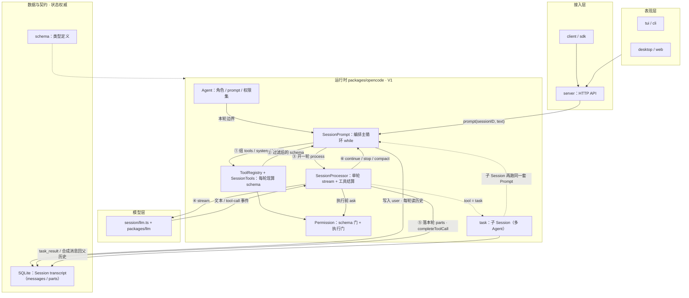
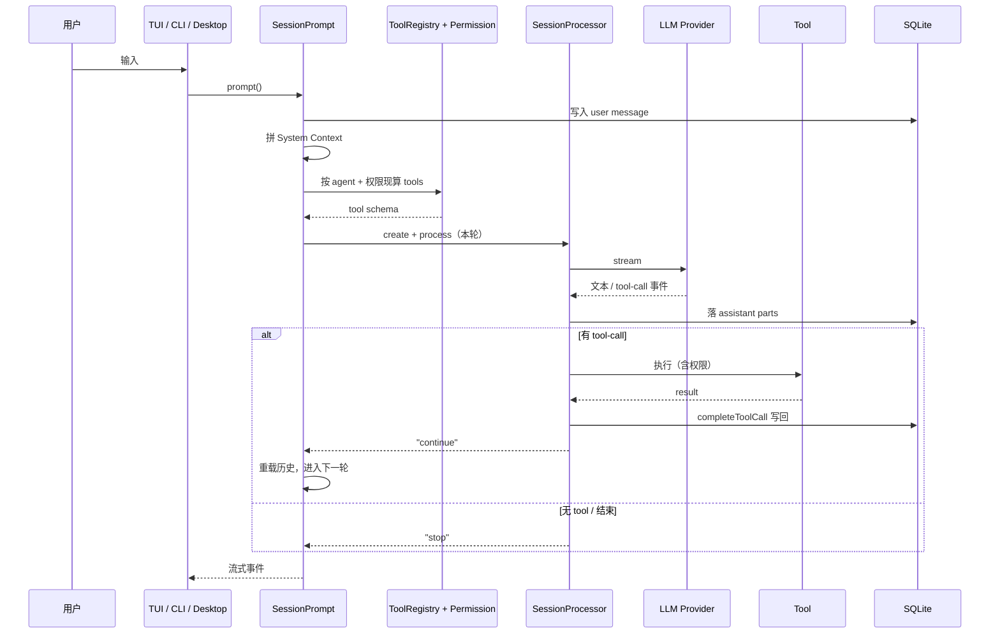
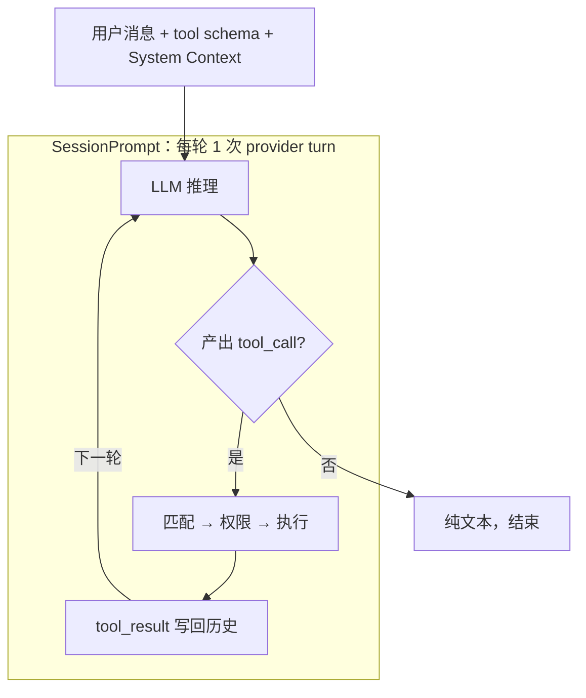
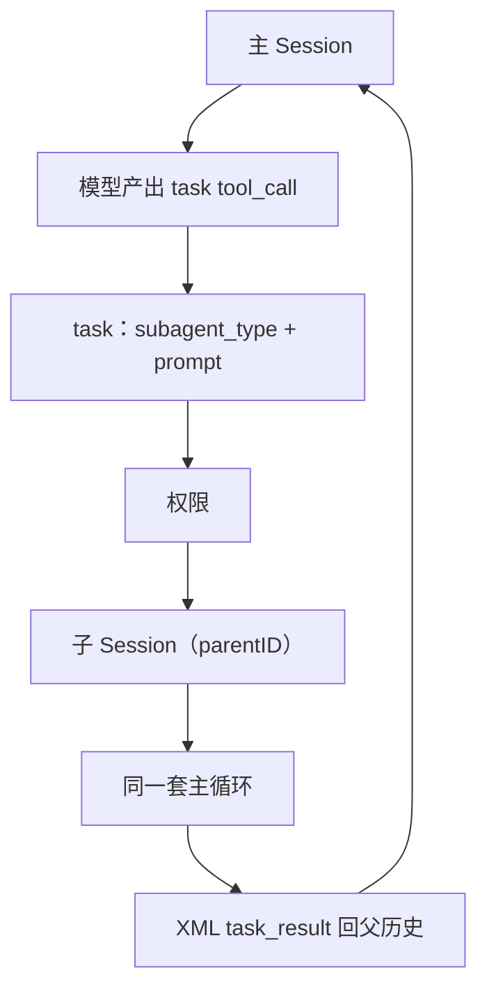

# OpenCode 架构速览

> 阅读范围：`D:\workplace\opencode`
> 关注点：模块划分、状态 / 编排 / 数据流各自靠谁、用户意图如何被识别、Subagent 如何协作
> 不含代码细节；编排与数据流对照见 [05b-min-agent-state-dataflow.md](./05b-min-agent-state-dataflow.md)（本平台）与本文 §1

---

## 1. 整体分层

OpenCode 是 Bun/TypeScript monorepo。运行时主体在 `packages/opencode`，可复用内核在 `packages/core`，UI 和 SDK 在外围。



依赖方向：`schema` → `core` → `opencode` → `server` → `client`。

图上编号是一次 drain 内的主路径：①② 编排准备 → ③④⑤ 单轮执行并落库 → ⑥ 回 Loop 决定是否再开一轮。跨轮数据只经 DB 里的 transcript（含 tool_result），不经 Processor 内部状态。

### 1.1 状态、编排、数据流分别靠谁

| 事 | 负责模块 | 做什么 |
|----|----------|--------|
| 保存状态 | `Session` / `MessageV2` / SQLite | 会话 transcript 的权威存储 |
| 编排 | `SessionPrompt.runLoop` | `while`：组 tools/system/history，决定要不要再跑一轮 |
| 单轮执行 | `SessionProcessor.process` | 一次 `llm.stream` → 落本轮 parts → 结算 tools → 返回 `continue` / `stop` / `compact` |
| 跨轮数据 | 历史里的 tool_result | 下一轮 `toModelMessages` 再读出 |
| 多 Agent | `task` + 子 Session | 不经过 Processor |

`SessionProcessor` 只覆盖单轮：`create` → `Handle`，核心是 `process()`。

```text
SessionPrompt（编排）
  └─ 每轮：组 tools / system / history
       └─ SessionProcessor.process（单轮）
            └─ llm.stream → 写 parts → 结算 tools → 返回 continue/stop/compact
```

### 1.2 V1 / V2 两条路径

| | V1（TUI / 实例 HTTP 仍在用） | V2（`packages/core`，server API 已暴露） |
|--|--|--|
| 编排 | `SessionPrompt` `while` | `SessionRunner` + `RunCoordinator` |
| 单轮 | `SessionProcessor` | runner 内直接 `llm.stream` + 事件投影（无同名 Processor） |
| 输入 | 写入即进历史 | inbox 准入，再按 `steer` / `queue` 提升 |
| 多 Agent | `task` → 子 Session | 尚未迁完 `task` |

---

## 2. 一次请求的完整路径（V1）



| 概念 | 含义 |
|------|------|
| Provider Turn | 向模型发一次请求并拿到一段助手输出；Processor 管的就是这一轮 |
| tool_result 回灌 | 结果写入历史后才能进下一轮；模型看不到工具返回值，必须靠循环 |
| Session Drain（V2） | 提升 inbox → 跑完必要的 provider turn |
| System Context | 环境、技能、项目说明、agent system prompt 等 |
| Context Epoch（V2） | 上下文基线生命周期；压缩后开新 epoch |

---

## 3. 用户意图怎么被识别

没有独立意图分类器。解读在两层：

- **显式**：当前 agent、`@agent` 提及 → 决定本轮 prompt / 权限 / 工具边界  
- **隐式**：模型在 FC 里选出 `tool_calls`

### 3.1 函数调用

1. **现算 tools**：`ToolRegistry` + 权限减法（`deny` 的不进 schema）；`task` 描述动态附上可调 subagent。  
2. **注入 System Context**：环境标志、`AGENTS.md`、技能、agent system prompt。  
3. **模型产出 tool_calls → 执行 → 写回历史 → 下一轮**。



循环由 `SessionPrompt` 驱动。`SessionProcessor` 执行这一轮的流式与工具结算，返回 `continue` / `stop` / `compact`。连续 3 次相同调用会触发 `doom_loop` 询问。

用户意图 = 模型在工具 schema 约束下选出的那组 `tool_calls`。

### 3.2 权限：两道门

| 阶段 | 作用 |
|------|------|
| schema | 硬 `deny` 的工具不进 schema |
| 执行 | `ctx.ask` → `allow` / `deny` / `ask` |

规则来源：agent + session + 用户临时 `always`，最后命中生效。

---

## 4. Subagent

### 4.1 定义

- `primary`：用户可选（build、plan），一般不进 task 候选  
- `subagent`：只能被 `task` 唤起（general、explore）  
- `all`：两用；内部还有 `title` / `compaction` 等隐藏用途  

### 4.2 调用链



### 4.3 生命周期要点

1. 子 Session 独立 transcript，不共享父完整对话  
2. 权限：继承父 `deny`，默认再 deny `task` / `todowrite`  
3. 前台阻塞等结果；后台注入合成消息（实验开关）  
4. `task_id` 可恢复同一子 Session  

通道：spawn prompt → 子 transcript → `task_result` / 异步通知。本平台对应见 [05b](./05b-min-agent-state-dataflow.md)。

---

## 5. 模块对照表

| 关心的事 | 主要位置 |
|----------|----------|
| Agent 定义与内置角色 | `packages/opencode/src/agent/agent.ts` |
| 主循环（编排） | `packages/opencode/src/session/prompt.ts` |
| 每轮工具组装 | `packages/opencode/src/session/tools.ts`、`tool/registry.ts` |
| provider turn 流事件与工具结算 | `packages/opencode/src/session/processor.ts` |
| LLM 调用 | `packages/opencode/src/session/llm.ts`、`packages/llm` |
| 权限判定 | `packages/opencode/src/permission/index.ts` |
| Subagent（task） | `packages/opencode/src/tool/task.ts` |
| Subagent 权限继承 | `packages/opencode/src/agent/subagent-permissions.ts` |
| System Context | `packages/opencode/src/session/system.ts`、`instruction.ts` |
| V2 运行时 | `packages/core/src/session/runner/` |
| HTTP API | `packages/server/src/handlers/session.ts` |
