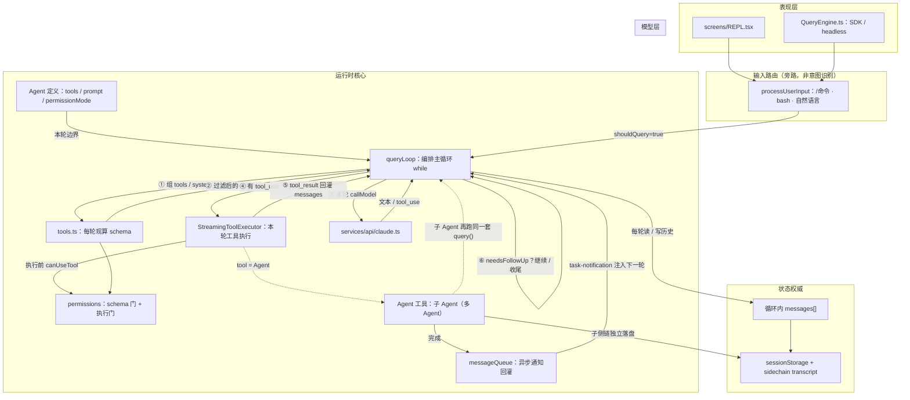
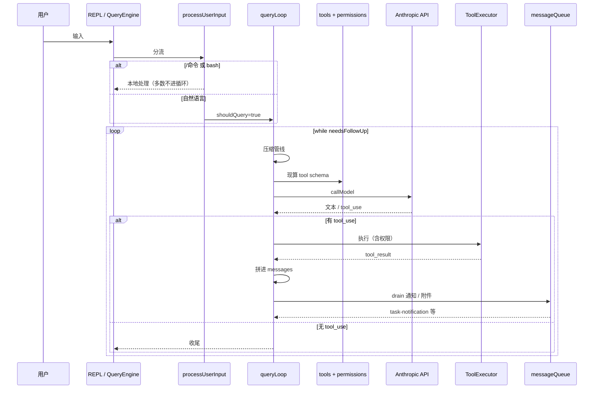
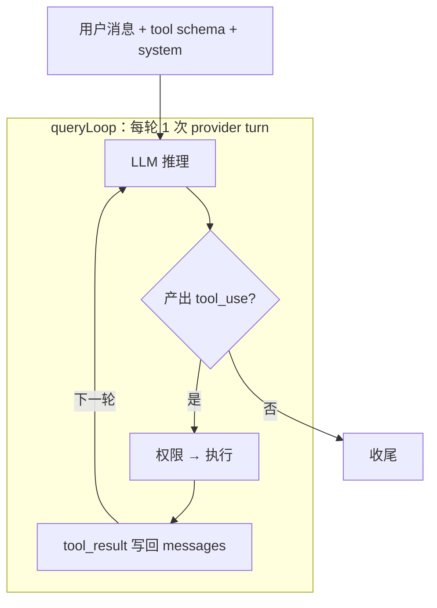
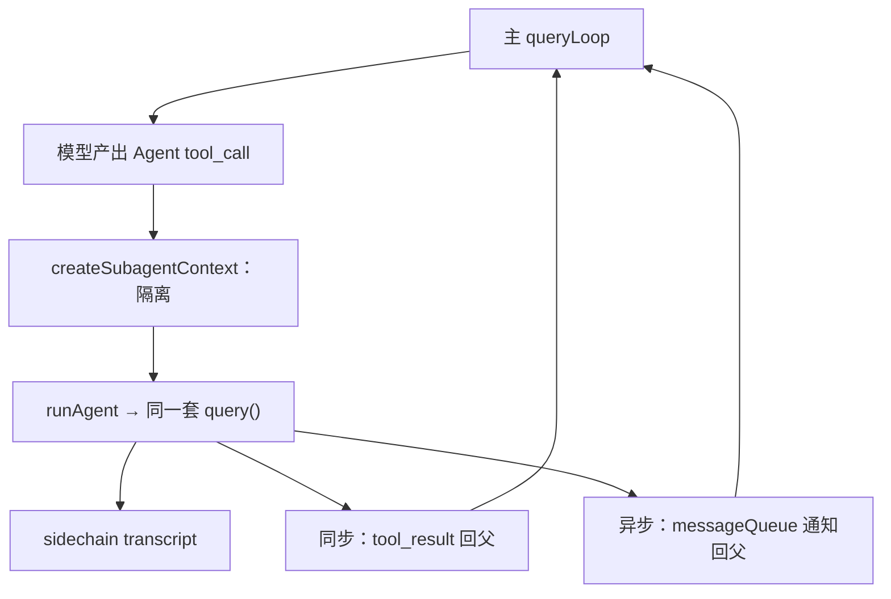

# Claude Code 架构速览

> 阅读范围：`D:\workplace\collection-claude-code-source-code`，重点 `claude-code-source-code/src`（`@anthropic-ai/claude-code@2.1.88` 反编译）
> 关注点：模块划分、状态 / 编排 / 数据流各自靠谁、用户意图如何被识别、Subagent 如何协作
> 与 [01-opencode-architecture.md](./01-opencode-architecture.md) 同一套写法；本平台编排见 [05b-min-agent-state-dataflow.md](./05b-min-agent-state-dataflow.md)
> 参考：[claude-code-restored](https://github.com/didilili/claude-code-restored)

---

## 0. 仓库是什么

`collection-claude-code-source-code` 是合集；本文只读真实客户端 `claude-code-source-code/src`。

| 子项目 | 性质 |
|--------|------|
| `claude-code-source-code` | 反编译还原 v2.1.88（本文对象） |
| `original-source-code` | 泄露快照 |
| `claw-code` / `nano-claude-code` | Python 二次演绎，不当权威 |

定位：终端编码 Agent；Bun + React/Ink TUI；Zod 工具 schema；Anthropic API 做 FC。与 OpenCode 同物种，骨架相近。

---

## 1. 整体分层

不是 monorepo，而是大 `src/`。核心是 `query.ts` 的 `queryLoop`；外围是工具、权限、任务、UI。



读源码顺序：`processUserInput` → `query.ts` → `services/tools/` → `tools.ts` → `utils/permissions/` → `tools/AgentTool/`。UI（`components/`、`ink/` 等）初读跳过。

图上编号：①② 编排准备 → ③④⑤ 单轮调模型并执行工具 → ⑥ 回 Loop。跨轮数据经 `messages`（含 tool_result）与队列通知，不经某个「超级 Processor」。

### 1.1 状态、编排、数据流分别靠谁

| 事 | 负责模块 | 做什么 |
|----|----------|--------|
| 保存状态 | `messages[]` + `sessionStorage` / sidechain | 主会话与子 Agent 各自 transcript |
| 编排 | `queryLoop`（`query.ts`） | `while(true)`：压缩 → 调模型 → 有 tool 则执行回灌 → 决定是否再开一轮 |
| 单轮工具 | `StreamingToolExecutor` / `toolOrchestration` | 本轮 `tool_use` 的并行/串行结算 |
| 跨轮数据 | 历史里的 tool_result；`messageQueue` 通知 | 下一轮拼进 `messages` |
| 多 Agent | `Agent` 工具 + `createSubagentContext` | 隔离上下文；默认同步 tool_result，异步走通知 |

Claude Code **没有** OpenCode 那种独立的 `SessionProcessor`。单轮流式消费和「要不要续跑」都写在 `queryLoop` 里；工具执行器只覆盖本轮 tool 结算。

```text
queryLoop（编排）
  └─ 每轮：压缩 → 现算 tools → callModel
       ├─ 流式收 assistant / tool_use
       └─ StreamingToolExecutor（本轮 tools）→ 回灌 → needsFollowUp？
```

### 1.2 和 OpenCode 模块名的对应

| OpenCode（V1） | Claude Code | 说明 |
|----------------|-------------|------|
| SessionPrompt | `queryLoop` | 编排主循环 |
| SessionProcessor | （内嵌在 queryLoop）+ 工具执行器 | 无同名单轮门面；职责拆在 loop 与 executor |
| SQLite transcript | `messages` + session/sidechain 文件 | 形态不同，都是会话权威 |
| task + 子 Session | Agent 工具 + sidechain | 默认同进程再入 `query()` |

---

## 2. 一次请求的完整路径



| 概念 | 含义 |
|------|------|
| provider turn | 一次 `callModel`；`queryLoop` 一轮对应一次 |
| `needsFollowUp` | 本轮流里出现过 `tool_use` 则续跑（不依赖 `stop_reason`） |
| attachments | 工具批后注入的合成上下文（文件变更、记忆、队列命令等） |
| autoCompact / microcompact | 主动摘要压缩 / 替换旧 tool_result 正文 |

入口两个、循环一个：REPL → `query()`；SDK → `QueryEngine` → `query()`。

---

## 3. 用户意图怎么被识别

没有独立意图分类器选工具。多一道确定性输入路由。

### 3.1 前置路由（旁路）

`processUserInput`：bash、`/` 斜杠命令本地处理；自然语言才进主循环。斜杠是快捷入口，不是 FC 意图识别。

### 3.2 主循环内：函数调用

1. **现算 tools**：deny 的不进 schema；工具过多时 `ToolSearch` 延迟加载。  
2. **注入 system / context**。  
3. **模型产出 tool_use → 执行 → 写回 messages → 下一轮**。



用户意图 = 模型在工具 schema 约束下选出的那组 `tool_use`。

### 3.3 权限：两道门

| 阶段 | 作用 |
|------|------|
| schema | blanket deny 的工具不进 schema |
| 执行 | `canUseTool` 多级链：deny / ask / 工具自检 / 模式短路 / allow |

模式含 `default` / `plan` / `acceptEdits` / `bypassPermissions` / `dontAsk` / `auto`（ML 分类器，内部特性）。业务助手通常只需对齐 allow/deny/ask，不必搬 ML 与六模式矩阵。

---

## 4. Subagent

先分清三套「task」：`Agent` 工具（真 subagent）、`tasks/`（后台执行态）、`TaskCreate*`（todo 清单）。本节只谈第一套。

### 4.1 定义

- 内置：`general-purpose`、`Explore`、`Plan` 等（`subagent_type` 查表）  
- 自定义：`.claude/agents/*.md` frontmatter  
- 候选写进 `Agent` 工具 description，模型自选  

### 4.2 调用链



### 4.3 生命周期要点

1. 默认**不**继承父完整对话（fork 实验路径除外）  
2. 隔离：克隆 file state；异步 `setAppState` 置空；独立 abort / sidechain  
3. 默认同步阻塞；`run_in_background` / 协调者等走异步通知  
4. 默认禁再派 `Agent`，防无限嵌套  
5. 协调者 / swarm / 邮箱偏重，非 min_agent P2 必选项  

通道：spawn prompt → 子 transcript → tool_result / `<task-notification>`。本平台对应见 [05b](./05b-min-agent-state-dataflow.md)。

---

## 5. 模块对照表

| 关心的事 | 主要位置 |
|----------|----------|
| 主循环（编排） | `src/query.ts`（`queryLoop`） |
| SDK / headless | `src/QueryEngine.ts` |
| 输入路由 | `src/utils/processUserInput/` |
| 本轮工具执行 | `src/services/tools/` |
| API / schema | `src/services/api/claude.ts` |
| 压缩 | `src/services/compact/` |
| System / context | `src/context.ts`、`constants/prompts.ts` |
| 工具注册与每轮组装 | `src/tools.ts`、`utils/toolPool.ts` |
| 权限 | `src/utils/permissions/` |
| Subagent | `src/tools/AgentTool/` |
| 异步通知队列 | `src/utils/messageQueueManager.ts` |
| 会话 / 侧链落盘 | `src/utils/sessionStorage.ts` |
