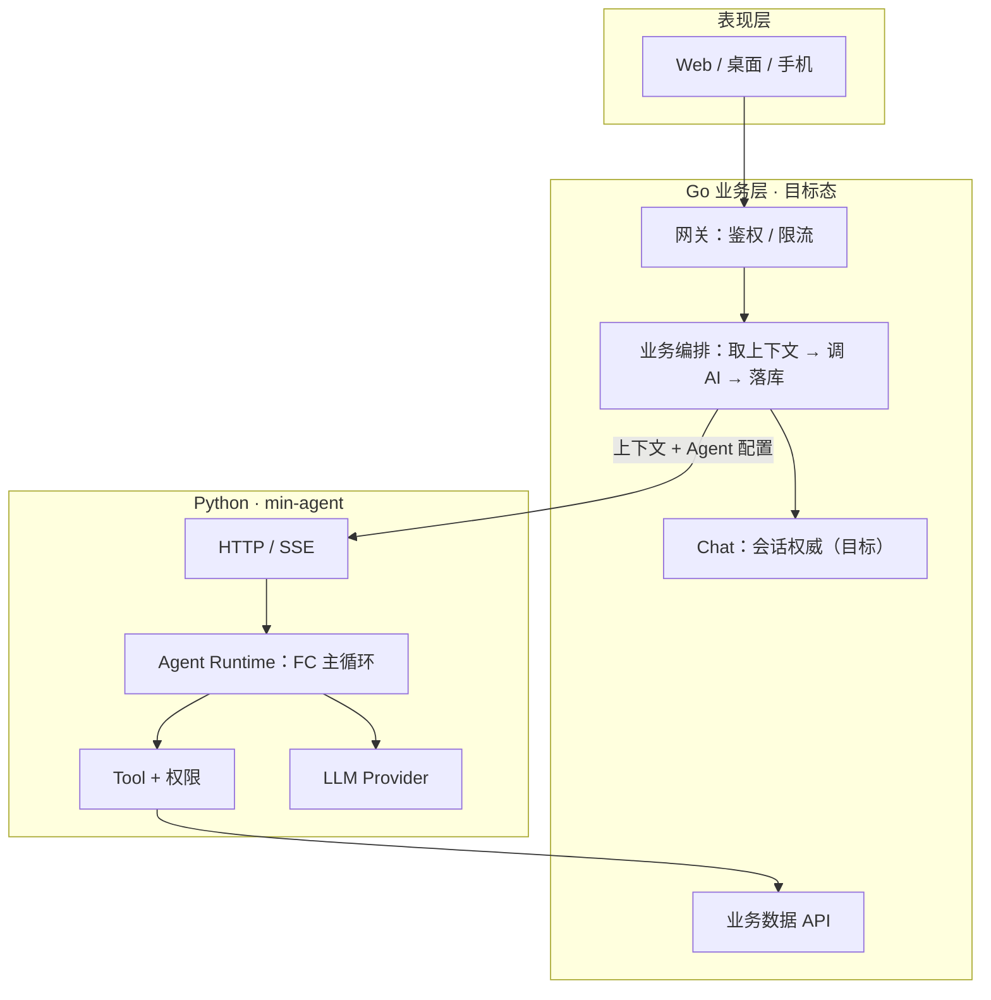
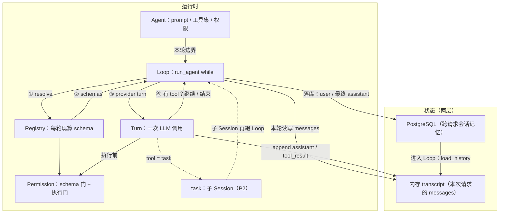

# min-agent 架构速览

> 目标：落地 min-agent 前台 FC 助手（ChatOps：自然语言操作 go-admin）
> 默认 Agent：`min_agent`（FC 前台）；固定流水线若再需要，经 tool 挂载，不进主循环
> 方法：对齐 OpenCode / Claude Code 的 Store / Loop / Turn，不搬编码专用能力
> 产品真源：本仓库 `documents/系统总体规划.md`
> 对照解读：[01](./01-opencode-architecture.md) · [03](./03-claude-code-architecture.md)
> 模块细读：[05a](./05a-min-agent-loop-agent.md) · [05b](./05b-min-agent-state-dataflow.md)
> 目录与阶段：[06](./06-min-agent-tree.md)
> 实现规格（以它为准）：本仓库 `openspec/`（基线在 `openspec/specs/`；进行中在 `openspec/changes/`）

---

## 1. 整体分层

平台分两圈：系统圈（谁对外、谁持状态）与 Python 运行时圈（FC 怎么跑）。

### 1.1 系统圈（跨服务）



要点：

- 目标态：Client 不直连 Python；Go 唯一对外入口
- 业务数据归 Go；Python 不直连业务 MySQL
- 过渡态：可直打 Python；短记忆暂落 Python 侧 PostgreSQL，再迁 Go Chat

### 1.2 Python 运行时圈

与 OpenCode V1 / Claude `queryLoop` 同构，模块名用 Store / Loop / Turn：



| 角色 | 做什么 | OpenCode | Claude Code |
|------|--------|----------|-------------|
| Store | 跨请求会话记忆（PostgreSQL）；进入 Loop 时装进内存 | SQLite messages | messages + sidechain |
| 内存 transcript | 本次请求的 `messages`（含中途 tool_result）；主要喂模型 | 进程内消息列表 | 同左 |
| Loop | 要不要再开一轮 | SessionPrompt | queryLoop |
| Turn | 一次 LLM（+ 本轮工具结算） | SessionProcessor | 内嵌 loop + ToolExecutor |
| Agent | 配置边界，不是循环本体 | Agent 定义 | AgentDefinition |

Store 管落库与续聊，内存 transcript 管本轮 FC；Loop 管编排，Turn 管单轮。不要做成一个 Processor 包办一切。

---

## 2. 一次请求路径（过渡态）

```mermaid
sequenceDiagram
    participant U as 用户
    participant API as POST /chat 或 CLI
    participant Loop as run_agent
    participant Mem as 内存 messages
    participant Reg as Registry
    participant LLM as LLM
    participant GW as gateway
    participant DB as PostgreSQL

    U->>API: message
    API->>DB: 载历史
    API->>Mem: 拼 system + history + user
    API->>DB: 存 user
    API->>Loop: run
    loop 每轮 = 一次 Turn
        Loop->>Reg: resolve tools
        Loop->>LLM: messages + schemas
        alt 有 tool_calls
            Loop->>GW: execute query 等
            GW-->>Loop: tool_result
            Loop->>Mem: append tool_result
        else 无 tool_calls
            Loop->>DB: 存 assistant
            Loop-->>API: reply
        end
    end
```

---

## 3. 意图怎么识别

没有独立意图分类器，也不做规则预路由 / 固定两阶段管道。

- 显式：当前 Agent（工具集 + system prompt + 权限）划定边界
- 隐式：模型在 schema 约束下产出 `tool_calls`

用户意图 = 这组 `tool_calls`。业务与编码 Agent 的差异只在工具语义（query/navigate vs read/edit）。

---

## 3.1 固定流水线挂载（方案 A）

`min_agent` 是 FC 前台（开放问答、选工具）。会议纪要、PPT 等步骤固定的能力不塞进 Loop，做成独立 Workflow，再挂到前台（现行产品不含已下线的招商话术）：

```text
用户 ↔ min_agent（FC + transcript（聊天记录））
         ├─ query / navigate          轻工具（P0/M1：go-admin 只读）
         ├─ meeting_minutes(...)      → 会议纪要 Workflow（后续）
         └─ ppt_generate(...)         → PPT Workflow（后续，现为占位）
              或 P2：task(subagent=…)
```

| 约定 | 说明 |
|------|------|
| 边界 | tool 入参 = 任务说明 + 材料；出参 = 摘要 + 产物链接/ID |
| 内部 | 可用自研状态机或独立 HTTP 服务；不要嵌进 `agent_core` |
| 进度 | Workflow 进度经流式/SSE change 转给 UI（或异步完成后通知） |
| 隔离 | 父 Session 默认看不到子流程完整中间态（见 05b 窄通道） |
| 失败 | 外部服务不通 → 结构化错误回灌，进程不崩（全 tool） |

P0/M1：ChatOps `query`（users / login_logs）；纪要 / PPT 按阶段加，不改 Loop 核心。

---

## 4. 权限：两道门（P1 起完整）

| 阶段 | 作用 |
|------|------|
| schema | 硬 deny 的工具不进本轮 schema |
| 执行 | allow / deny / ask |

P0：仅 Agent 声明的工具白名单。业务数据范围仍由 Go 裁（身份随工具请求透传）。

---

## 5. 挂在主循环上的能力

| 能力 | 阶段 | 要点 |
|------|------|------|
| 流式 + 边做边提示 | P1 | Turn 改 stream；另开事件通道推 UI（`tool_start` / `tool_end` / `text_delta` / `done`），对标 OpenCode tool part 状态 + bus；与给模型的 `messages` 分开 |
| 历史截断 | P1 | token 预算，硬截断即可 |
| 权限两道门 / `question` | P1 | schema 门 + 执行门；澄清用 `question` |
| 压缩 compaction | P3 | 用量 ≥ 窗口 − reserved 时 prune → summarize → 硬截断；只压内存 messages；见 `p3-context-compaction` |
| 短期记忆 | P0 | Store（PostgreSQL 跨请求）+ 本轮内存 `messages` |
| 长期记忆 | P2 | 检索注入 system/user 前缀，勿与 compaction 混成一个模块 |
| skill / @引用 | P2 | 按需进 context |
| task / 纪要·PPT | P2 | 经 tool 或 `task` 挂载（§3.1）；默认同步、禁嵌套 |
| MCP / 后台 / 联网 | P3 | 工具规模大了再考虑延迟加载 |

不搬：read/edit/bash/lsp/git/worktree、斜杠命令、ML 权限、swarm、fork cache。

---

## 6. 与参考实现的映射

| OpenCode / Claude | min-agent |
|-------------------|-------------|
| Session 持久化（跨请求聊天记录） | Store（PostgreSQL） |
| 本轮 messages（内存 transcript） | Loop 内 list |
| SessionPrompt / queryLoop | Loop |
| SessionProcessor / 单轮执行 | Turn |
| part 更新 + bus / SSE | P1 进度事件（边做边提示） |
| task / Agent 工具 | P2 `task` + 纪要/PPT 等 Workflow tool |

细则见 [05a](./05a-min-agent-loop-agent.md)、[05b](./05b-min-agent-state-dataflow.md)。

---

## 7. 文档与 OpenSpec

| 文档 | 管什么 |
|------|--------|
| 本文 | 分层、意图、权限、能力挂载 |
| [05a](./05a-min-agent-loop-agent.md) | Loop / Turn / Agent / 工具 |
| [05b](./05b-min-agent-state-dataflow.md) | Store、L0/L1/L2、多 Agent 通道 |
| [06](./06-min-agent-tree.md) | 目录树、P0–P3、验收 |
| 本仓库 `openspec/` | 实现规格与 tasks（以它为准；冲突时压过本文） |
| `01`–`04` | OpenCode / Claude 源码解读 |
