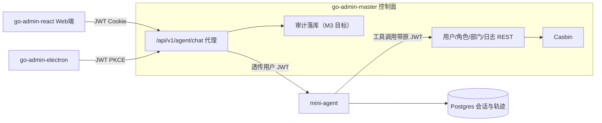

# 系统总体规划（大层面需求）

> 本文档描述**四仓库整体系统**的定位与大层面需求，是最上层的叙事文档。  
> 实现时以本文件验收口径为准；各仓库细节规格以各自 `openspec/` 为准。  
> 推进节奏见本仓库 `.cursor/rules/master-plan-rhythm.mdc`（一句话「按总体规划继续」即可触发下一切片）。  
> min-agent 自身能力排期见 [min-agent后期能力展望](./min-agent后期能力展望.md)。

---

## 产品概述

**基于 RBAC 与多端协同的企业级 Agent 管理平台**

**项目描述：** 面向企业内部管理场景，构建「Web 控制台 + Electron 桌面助手 + Go 控制面 + Python Agent」一体化平台；支持角色权限与数据权限下的后台管理，以及自然语言驱动的后台操作（ChatOps），操作全程可审计。

**技术栈：** Go + Gin + GORM + Casbin + JWT + OAuth2/PKCE + React + Ant Design + Electron + Python + Function Calling + PostgreSQL

- **权限与安全：** 基于 Casbin 实现接口鉴权与数据权限（全部 / 本部门 / 仅本人），禁止角色名短路；管理端采用 Cookie + JWT 双通道取证，桌面端落地 OAuth 2.0 Authorization Code + PKCE，统一业务 Claims。
- **多端架构：** 拆分为控制面、Agent 运行时、React 管理端与 Electron 桌面端；桌面经系统浏览器完成授权后换取业务 JWT，与 Web 共用同一套用户体系与 getinfo 契约。
- **Agent 与工具调用：** 实现多轮 Function Calling 循环与会话持久化；将后台 REST API 注册为工具，并透传调用方 JWT，使 Agent 能力上限等于提问者权限；写操作引入二次确认，降低误操作风险。
- **可观测与审计：** 记录每轮工具调用轨迹（参数、权限拒绝、耗时与 token）；Web 端提供会话详情回放，支撑管理员对 Agent 操作的事后追溯。

### 能力 ↔ 需求映射

| 能力 | 对应需求 | 验收一句话 |
|------|----------|------------|
| 权限与安全 | R1 | `admin` / `deptmgr` / `selfonly` 同接口数据范围不同；无 `rolekey==admin` 短路；SPA Cookie+JWT；桌面 PKCE 换同一套 JWT |
| 多端架构 | R2 | Web / Electron / Go / Python 四端；桌面 PKCE → Bearer；`getinfo` 共用 |
| Agent 与工具调用 | R3 | FC 多轮 + 会话落 Postgres；工具调 go-admin API 且带用户 JWT；写操作二次确认 |
| 可观测与审计 | R4 | 轨迹含工具/参数/拒绝/耗时/token；Web 可回放会话；管理员可看他人会话、普通用户仅本人 |

> R5（工具-角色配置等）为可选增强，不对应产品概述能力条目。

---

## 一句话定位

**一个自带 RBAC 权限体系的 Agent 平台：用自然语言操作管理后台，所有操作受角色权限约束、全程可审计；Web 端管理，桌面悬浮球随时唤起。**

大模型只负责解析意图，系统的实体是三层：**工具层（后台 REST API）+ 权限层（JWT + Casbin）+ 审计层（会话与执行轨迹落库）**。

## 系统组成

| 仓库 | 本地路径 | 角色 | 现状 |
|------|----------|------|------|
| `go-admin-master` | `E:\Edesktop\workplace\my-agent-project\go-admin-master` | Go 控制面 | R1 主体已落地；agent chat + trail 代理已落地；会话轨迹按数据权限可见 |
| `mini-agent` | `E:\Edesktop\workplace\my-agent-project\mini-agent` | Python Agent | M0–M4 相关能力已落地；会话归属 + 轨迹 ACL 已落地 |
| `go-admin-react` | `E:\Edesktop\workplace\my-agent-project\go-admin-react` | Web 控制台 | 后台 CRUD + **会话轨迹回放页**已落地；聊天页可后置 |
| `go-admin-electron` | `E:\Edesktop\workplace\my-agent-project\go-admin-electron` | Electron 桌面助手 | 登录壳 + 悬浮球 + 工作台快捷提问已挂 `/api/v1/agent/chat`（change `m4-desktop-agent-quick-ask`） |

**部署约定（本地联调）：** 控制面 go-admin `:8000`；mini-agent `:8001`（代理上游 `agent.base_url` 默认 `http://127.0.0.1:8001`）；React 开发端口 `:9528`。

---

## 核心需求（实现清单）

### R1 权限与安全

**目标状态：基本已落地；实现时勿回退。**

- [x] Casbin 接口鉴权；禁止 `rolekey == "admin"` 短路
- [x] 数据权限：全部 / 本部门 / 仅本人（种子账号可演示）
- [x] SPA：`POST /login` 发 body `token` + Cookie `Admin-Token`；取证 Bearer → Cookie
- [x] 桌面：OAuth 2.0 Auth Code + PKCE；兑码后业务 JWT 与 `/login` 同源 Claims

### R2 多端架构

**目标状态：Electron 已挂同一代理；React 聊天页可后置。**

- [x] 四仓库边界：控制面 / Agent 运行时 / React / Electron
- [x] 桌面系统浏览器授权 → token → 与 Web 共用 `getinfo`
- [x] Go 提供统一 `POST /api/v1/agent/chat`（鉴权后转发 mini-agent，透传 JWT）
- [x] Electron 悬浮球工作台快捷提问只打该代理（change `m4-desktop-agent-quick-ask`；不直连 Agent）
- [ ] React 聊天页挂同一代理（可后置；轨迹回放页已落地）

### R3 Agent 与工具调用

**目标状态：写工具与二次确认已落地（M2）。**

- [x] 多轮 Function Calling 循环
- [x] 会话持久化（Postgres：`agent_sessions` / `agent_messages`）
- [x] 清除实习业务桩文案（佣金等品牌叙事；change `m0-clean-internship-copy`）
- [x] 工具改为调用 go-admin REST（替换本地演示桩）
- [x] 只读工具至少：查用户列表、查登录日志（或等价）
- [x] 工具 HTTP 请求携带**调用方 JWT**（能力上限 = 提问者）
- [x] Agent 路径上权限拒绝须返回可读原因，不得绕过 Casbin（随 M1-Agent 切片验收）
- [x] 写工具至少：创建用户 / 停用用户（或分配角色）之一套可演示路径
- [x] 写操作二次确认：先返回将影响对象清单，用户确认后再执行

### R4 可观测与审计

**目标状态：轨迹落库 + Web 回放 + 会话可见范围（数据权限）已落地。**

- [x] 每轮记录结构化轨迹：工具名、参数、权限拒绝、耗时、token 用量（表 `agent_tool_events`；change `m3-audit-trail`）
- [x] 轨迹可按 `session_id` 查询（`GET /sessions/{session_id}/trail`；控制面代理 `GET /api/v1/agent/sessions/:id/trail`）
- [x] Web：会话详情页回放工具调用链（React `会话轨迹`；change `m3-agent-trail-proxy` + 页面）
- [x] 管理员（数据权限「全部」）可查看他人会话；普通用户仅本人（会话 `owner_user_id` + JWT `datascope`；change `r4-session-visibility`）

### R5 可选增强（勿挤占主路径）

- 工具-角色配置页（角色可用工具白名单）
- docker-compose / CI badge / 开源 README GIF

## 后续计划

> 不阻塞当前 M0–M5 主路径；需要时另开 change。

- **桌面认证深化：** OAuth 2.0 Authorization Code + PKCE 与客户端（Electron）联调收口（替换/收敛过渡登录方式）
- 通用 RAG、多模型编排、Agent 编排画布
- 上传 / 代码生成 / 定时任务等 go-admin 可选模块

---

## 里程碑

| 阶段 | 覆盖能力 | 目标 | 验收 |
|------|----------|------|------|
| M0 保底 | 权限与安全 + 多端壳 | 回归 Casbin / Cookie+JWT / PKCE / getinfo；清实习文案 | 种子三角色数据权限演示 + 桌面 PKCE 登录成功；**mini-agent 活跃文案已清**（change `m0-clean-internship-copy`） |
| M1 链路 | Agent 半条 + 多端入口 | `/api/v1/agent/chat` + 只读工具 + JWT 透传；Web 聊天页可后置 | 经 `/api/v1/agent/chat`（curl）同问，`admin`≠`deptmgr`；**代理+只读工具已落地**；冒烟 `go-admin-master/test/smoke/agent-m1.cmd` |
| M2 写确认 | Agent 写全 | 写工具 + 二次确认 | 「给张三开账号」确认后执行成功；**mini-agent `write` 已落地** |
| M3 审计 | 可观测与审计 | 轨迹落库 + Web 回放 | **已落地**：落库 + Go trail 代理 + React 回放；会话可见范围见 R4 |
| M4 桌面 | 多端架构收尾 | Electron 悬浮球挂同一代理 | **已落地**：工作台快捷提问 → `POST /api/v1/agent/chat` |
| M5 门面 | 开源加分 | compose / README / 演示 GIF | 外人 10 分钟跑通 M1 场景 |

**建议推进顺序：** 主路径 M0–M4 已齐；下一切片可为 **M5 门面** 或 R2 React 聊天页。

## 演示脚本

1. **权限与安全：** `admin` vs `deptmgr` 调同一用户列表，行集不同；说明无角色名短路。
2. **多端：** Electron 登录后 `getinfo` 与 Web 同用户。
3. **Agent：** Web/桌面问「本部门有哪些人」→ 轨迹显示工具调用且带权限差异；再演示写操作二次确认。
4. **审计：** 打开该会话详情，回放工具参数与（若有）权限拒绝记录；`admin` 可查他人 `session_id`，`selfonly` 查他人应被拒绝。
