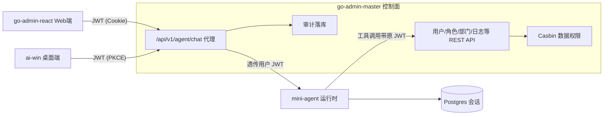

# 系统总体规划（大层面需求）

> 本文档描述**四仓库整体系统**的定位与大层面需求，是最上层的叙事文档。  
> 各仓库的实现规格以各自的 `openspec/` 为准；min-agent 自身的能力排期见 [min-agent后期能力展望](./min-agent后期能力展望.md)。

---

## 一句话定位

**一个自带 RBAC 权限体系的 Agent 平台：用自然语言操作管理后台，所有操作受角色权限约束、全程可审计；Web 端管理，桌面悬浮球随时唤起。**

大模型只负责解析意图，系统的实体是三层：**工具层（后台 REST API）+ 权限层（JWT + Casbin）+ 审计层（会话与执行轨迹落库）**。

## 系统组成

| 仓库 | 角色 | 现状 |
|------|------|------|
| `go-admin-master` | 控制面：用户 / 角色 / 部门 / 菜单、Casbin 数据权限、OAuth PKCE、Agent 请求入口网关 | 已落地，缺 Agent 代理接口 |
| `mini-agent` | Agent 运行时：多轮 Function Calling、会话持久化（Postgres） | 已落地，工具是本地桩，待替换 |
| `go-admin-react` | Web 控制台：后台管理页面 + 聊天页 + 审计页 | 后台管理已落地，缺聊天 / 审计页 |
| `ai-win` | 桌面助手：登录壳 + 悬浮球，快速唤起同一个 Agent | 壳已落地，缺聊天挂载 |

## 核心需求

### N1 自然语言操作后台（ChatOps，主卖点）

- 把 go-admin 已有 REST API 注册为 Agent 工具，例如：
  - "给张三开个账号，放到销售部，给 viewer 角色" → 依次调用创建用户 / 分配部门 / 绑定角色
  - "上周谁登录失败次数最多？" → 查登录日志并汇总
- **JWT 透传**：Agent 调工具时带的是当前用户自己的 JWT，Casbin 约束自动生效——同一句话，`admin` / `deptmgr` / `selfonly` 问，得到不同结果。
- **写操作二次确认**：改 / 删类工具先返回将影响的对象清单，用户确认后才执行。

### N2 权限与安全

- Agent 无自有特权账号，能力上限 = 提问者本人的权限。
- 权限被拒不是异常而是正常回答的一部分（"你无权查看其他部门数据"）。

### N3 可观测与审计

- 每轮对话记录执行轨迹：调了哪些工具、参数、哪步被权限拒绝、耗时与 token 数。
- Web 端提供会话详情页；管理员可回放任意用户的 Agent 操作记录。

### N4 多端入口

- Web：聊天页（与后台管理同一登录态）。
- 桌面：悬浮球唤起快捷提问窗，走 OAuth PKCE 登录，接同一个代理接口。

### N5 工具-角色配置（后期可选）

- 后台增加"工具管理"页：哪个角色能用哪些工具（读 / 写 / 危险操作）由管理员配置，把 RBAC 延伸到 Agent 能力本身。

## 非目标（当前不做）

- 通用 RAG 知识库、多模型编排、Agent 编排画布。
- 上传 / 代码生成 / 定时任务等 go-admin 可选模块（沿用其 openspec 缺口清单）。
- 移动端。

## 里程碑

| 阶段 | 目标 | 验收 |
|------|------|------|
| M1 链路打通 | 后端 `/api/v1/agent/chat` 代理 + mini-agent 挂 2~3 个只读工具（查用户 / 查登录日志） | Web 聊天页问"本部门有哪些人"，`admin` 与 `deptmgr` 答案不同 |
| M2 写操作 + 确认 | 挂创建 / 停用用户等写工具，带二次确认流程 | "给张三开账号" 全流程走通且留审计记录 |
| M3 审计可视化 | 会话详情页展示执行轨迹 | 管理员能回放任意会话的工具调用链 |
| M4 开源门面 | docker-compose 一键起、CI badge、主 README 架构图 + GIF、清理实习业务痕迹 | 新用户 10 分钟内本地跑通 demo |
| M5（可选） | 工具-角色配置页、桌面端悬浮球接入 | 角色不同可用工具不同 |

## 演示脚本（面向 README / 面试）

1. `admin` 登录 Web，问"上周谁登录失败最多"→ Agent 查日志给出答案，侧栏展示工具调用轨迹。
2. 切 `selfonly` 登录，问同一句 → 被权限拒绝，Agent 正常解释原因。
3. `admin` 说"给张三开个账号放到销售部" → Agent 列出将执行的三步，确认后执行，审计页出现完整记录。
